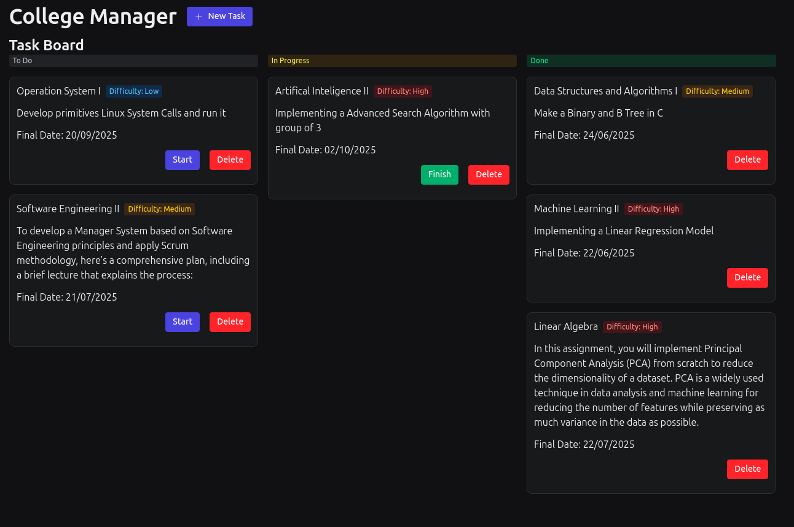
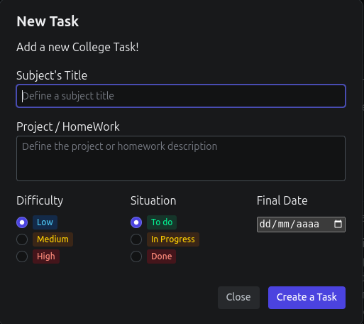

## College Manager 📋

- Project developed to merge concepts of **TypeScript** and **React** ⚛️💻
- Built with **ReactJs** and **TypeScript**. Additionally, **Radix UI** was used for styling, and **Json-Server** was used to perform CRUD operations. 💾 💻
- Semi-completed project (I plan to add new features and apply **NextJs** concepts). ⏳

**FEATURES**  
- Add a Task, allowing you to choose the subject, task description, difficulty, status, and due date. 📚  
- Manage task progress, moving it from 'to-do' to 'in progress' and then to 'completed' 🏁  
- Delete Tasks 🗑️

---

*Images:*

  

